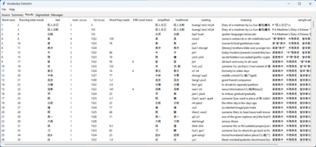

# Vocabulary Extractor

Vocabulary Extractor is a program to split any text into individual words, summarizing information about each unique word. The information is presented in the form of a tab-delimited matrix, so that the results can be easily copied and pasted into a spreadsheet program like Excel.

[](doc/screen-main.png)

The program can be extended in three different ways: dictionaries, extra columns, and filtered words. Dictionaries can be changed by adding in extra files into certain directories. The distribution includes a copy of CC-CEDICT and VNEDICT, but alternative dictionaries can be used as a replacement or in combination.

The word summary after text analysis can be modified by adding extra word data files, which will be incorporated into the output as extra columns.

If you need to filter out words from the output (for example, to eliminate words already learned), word lists can be added, and will be used to filter out matching words.

## Download

### Windows

Current version: [Vocabulary\_Extractor\_0.9.0-Windows.zip](http://www.zhtoolkit.com/apps/VocabularyExtractor/dist/Vocabulary_Extractor_0.9.0-Windows.zip) (2026-04-30)

### Source code

This project is hosted on [GitHub](https://github.com/cer28/VocabularyExtractor), and the source tree can be cloned using Git tools.

## Building

### Windows Executable

After completing [Windows setup](#windows-1) below:

```powershell
.\Build-Exe.ps1
```

If the script is blocked because it is accessed via a UNC path (e.g. `\\wsl.localhost\...`), set the execution policy for the current session first:

```powershell
Set-ExecutionPolicy -ExecutionPolicy Unrestricted -Scope Process
.\Build-Exe.ps1
```

This produces `dist\Vocabulary Extractor\` containing `Vocabulary Extractor.exe` and all required data files. Zip that folder to distribute.

## Running from Source

### Windows

#### Setup

```powershell
python -m venv venv
venv\Scripts\Activate.ps1
pip install -r requirements.txt
```

If you get the error:

> File ...\venv\Scripts\Activate.ps1 cannot be loaded because running scripts is disabled on this system

Run the following command first, then re-run `venv\Scripts\Activate.ps1`:

```powershell
Set-ExecutionPolicy -ExecutionPolicy RemoteSigned -Scope CurrentUser
```

When prompted, choose **Run Once** or **Always Run** as appropriate.

#### Run

```powershell
python main.py
```

### Linux

#### Setup

tkinter is part of the Python standard library but requires a separate system package:

```bash
sudo apt install python3-tk
```

Then set up the virtual environment:

```bash
python3 -m venv venv
source venv/bin/activate
pip install -r requirements.txt
```

#### Run

```bash
python main.py
```

### Headless / Command-Line Mode

The `--headless` flag runs the program without any UI and writes tab-delimited results to a file or stdout. This is useful for scripting or batch processing.

```bash
# Output to stdout
python main.py --headless -i samples/VN/mytext.txt

# Output to a file
python main.py --headless -i samples/VN/mytext.txt -o results.tsv
```

Additional options let you specify dictionaries, charset, filters, and extra column data directly on the command line, overriding whatever is in the config file:

```bash
python main.py --headless \
    -i samples/VN/mytext.txt \
    -o results.tsv \
    --dict dict/VN/vnedict.txt \
    --charset Vietnamese \
    --filter filter/VN/known-words.txt \
    --extracolumn data/VN/Freq_per_Million.txt
```

Run `python main.py --help` for the full list of options. See `doc/help.html` for detailed documentation.

## Help

See `doc/help.html` for detailed documentation.

## License

This project is released under the [GNU General Public License v3.0](COPYING.md).

© 2026 [zhtoolkit.com](http://www.zhtoolkit.com)
